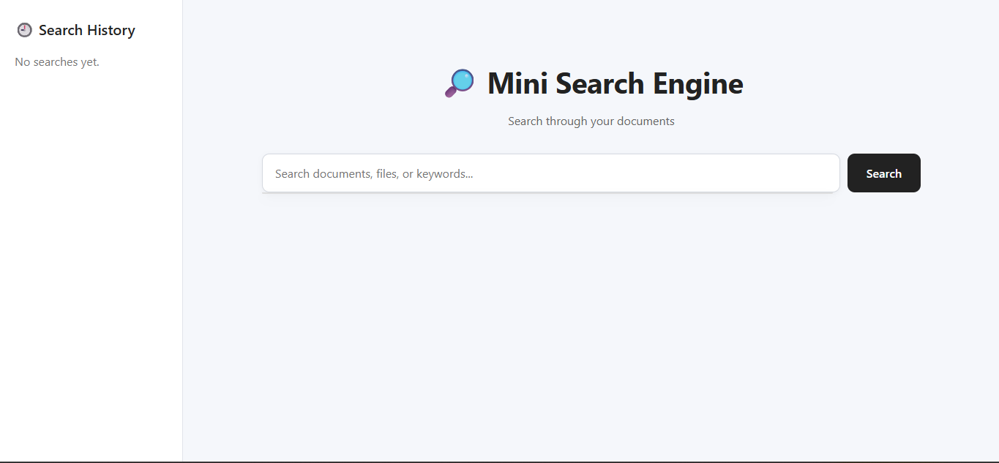
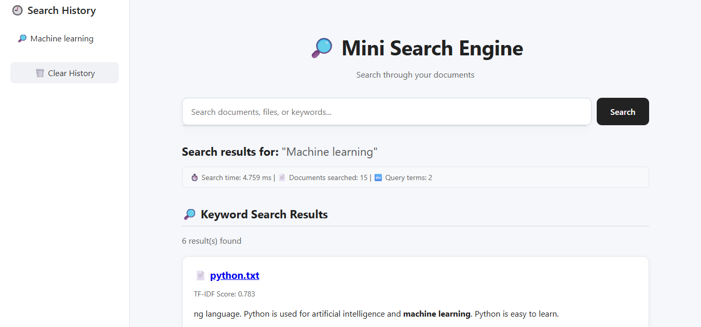

# Mini Search Engine

A portfolio-ready **Mini Search Engine** built with Python and Flask that combines traditional **TF-IDF keyword search** with **semantic search** and **hybrid ranking**.

The project demonstrates information retrieval, natural language processing, similarity measurement, search ranking, and web application development.

## 🚀 Live Demo

**Live Demo:** https://mini-search-engine-qqof.onrender.com/

**GitHub Repository:** https://github.com/ksudheeksha07/MiniSearchEngine

---

## ✨ Features

* 🔎 TF-IDF keyword search
* 🧠 Semantic search using Sentence Transformers
* 🔀 Hybrid search combining keyword and semantic scores
* ✍️ Spelling correction
* 💡 Live search suggestions
* 🕘 Search history
* 📊 Search statistics
* 📄 Clickable document results
* ⚡ Search-time measurement
* 📱 Responsive web interface
* 🧪 Search evaluation pipeline
* 📈 Precision, Recall, F1 and MRR evaluation
* ☁️ Render deployment

---
## 🖥️ Screenshots

### Desktop





### Mobile


 

## 🧠 Semantic Search

The project supports semantic search using the **Sentence Transformers** model:

`all-MiniLM-L6-v2`

The model converts documents and queries into numerical embeddings.

Cosine similarity is then used to measure how semantically similar a query is to each document.

This allows the search engine to retrieve related documents even when the exact query words are not present.

For example:

> `machines that learn from examples`

can retrieve documents related to machine learning even without requiring an exact keyword match.

---

## 🔀 Hybrid Search

Hybrid search combines:

* **Keyword search using TF-IDF**
* **Semantic search using embeddings**

The current baseline uses equal weighting:

`50% Keyword + 50% Semantic`

The scores are normalized before combining them.

A small experiment was also performed using different hybrid weights.

| Keyword | Semantic | Precision@5 | Recall@5 |  F1@5 |
| ------- | -------- | ----------: | -------: | ----: |
| 70%     | 30%      |       0.580 |    0.882 | 0.661 |
| 50%     | 50%      |       0.580 |    0.882 | 0.661 |
| 30%     | 70%      |       0.560 |    0.865 | 0.643 |

The 50/50 configuration is retained as the simple balanced baseline because the evaluation did not provide a clear reason to change it.

---

## 🛠️ Tech Stack

### Backend

* Python
* Flask

### Information Retrieval

* TF-IDF
* Inverted Index
* Term Frequency
* Inverse Document Frequency
* Cosine Similarity

### NLP / AI

* Sentence Transformers
* `all-MiniLM-L6-v2`
* Scikit-learn

### Frontend

* HTML
* CSS
* JavaScript

### Deployment

* Gunicorn
* Render

### Development

* VS Code
* Git
* GitHub

---

## ⚙️ How It Works

```text
User Query
     │
     ▼
Flask Web Application
     │
     ├───────────────┐
     │               │
     ▼               ▼
Keyword Search   Semantic Search
     │               │
     │               ▼
     │        Sentence Transformer
     │               │
     │               ▼
     │        Cosine Similarity
     │               │
     └───────┬───────┘
             ▼
       Hybrid Ranking
             │
             ▼
       Ranked Results
```

The search engine also provides supporting features such as:

* Live suggestions
* Spelling correction
* Search history
* Search statistics

---

## 📚 Dataset

The search engine currently contains **15 local text documents** covering computer science and AI-related topics:

* Artificial Intelligence
* Algorithms
* Computer Vision
* Cybersecurity
* Database
* Data Structures
* Deep Learning
* Generative AI
* Internet of Things
* Networking
* Natural Language Processing
* Operating Systems
* Programming
* Python
* Robotics

---

## 📂 Project Structure

```text
MiniSearchEngine/
│
├── app.py
├── search_engine.py
├── semantic_search.py
├── hybrid_search.py
├── index.py
├── main.py
│
├── documents/
│   ├── ai.txt
│   ├── algorithms.txt
│   ├── computer_vision.txt
│   ├── cybersecurity.txt
│   ├── database.txt
│   ├── data_structures.txt
│   ├── deep_learning.txt
│   ├── generative_ai.txt
│   ├── iot.txt
│   ├── networking.txt
│   ├── nlp.txt
│   ├── operating_system.txt
│   ├── programming.txt
│   ├── python.txt
│   └── robotics.txt
│
├── templates/
│   └── index.html
│
├── static/
│   └── style.css
│
├── evaluation/
│   ├── evaluate.py
│   ├── queries.json
│   ├── results.json
│   └── test_hybrid_weights.py
│
├── tests/
│   └── test_search.py
│
├── requirements.txt
├── .gitignore
└── README.md
```

---

## 💻 Installation

Clone the repository:

```bash
git clone https://github.com/ksudheeksha07/MiniSearchEngine.git
```

Move into the project directory:

```bash
cd MiniSearchEngine
```

Install dependencies:

```bash
pip install -r requirements.txt
```

Run the Flask application:

```bash
python app.py
```

Then open the local application in your browser.

---

## 🔎 Example Queries

The search engine can be tested using queries such as:

```text
python
machine learning
deep learning
computer vision
artificial intelligence
database
cybersecurity
robotics
internet of things
natural language processing
programming
```

It also supports queries containing spelling mistakes, such as:

```text
macine
```

which can provide a spelling suggestion.

---

## 🧪 Testing

The application was tested using:

1. `python`
2. `machine learning`
3. `macine`
4. `quantum`
5. Live search suggestions
6. Search history
7. Clear history
8. Document opening

The document results can be opened directly from the search interface.

---

## 📊 Evaluation

The search engine was evaluated using **10 information-retrieval queries** across the 15-document dataset.

### Results

| Method   | Precision@5 | Recall@5 |  F1@5 |   MRR |  Avg Time |
| -------- | ----------: | -------: | ----: | ----: | --------: |
| TF-IDF   |       0.930 |    0.757 | 0.815 | 1.000 |  6.420 ms |
| Semantic |       0.580 |    0.880 | 0.659 | 1.000 | 36.278 ms |
| Hybrid   |       0.580 |    0.882 | 0.661 | 1.000 | 38.178 ms |

These results are based on a small dataset of 15 documents and 10 evaluation queries, so they should not be interpreted as large-scale search-engine performance.

---

## ⚠️ Deployment Note

Semantic search is enabled during local development.

The deployed Render version uses:

```text
ENABLE_SEMANTIC_SEARCH=false
```

This is because the free Render environment has limited memory, and loading the Sentence Transformer model can exceed the available memory.

When semantic search is disabled, the application continues to provide keyword search and a hybrid-search fallback.

The complete semantic-search functionality remains available when running the project locally on a machine with sufficient resources.

---

## 🚧 Limitations

* Small local document collection
* No web-scale crawling
* No persistent database
* Search history is stored in memory
* Semantic model requires additional memory
* Evaluation dataset is relatively small

---

## 🔮 Future Improvements

Possible future improvements include:

* Larger document collections
* Web crawling
* Persistent search history
* Database integration
* Better ranking algorithms
* Query expansion
* More advanced NLP models
* Personalized search
* Larger-scale deployment
* Improved semantic ranking
* Automatic document indexing

---

## 🎯 Project Goals

This project was developed to gain practical experience with:

* Information Retrieval
* Natural Language Processing
* Machine Learning
* Search Ranking
* Semantic Similarity
* Flask Web Development
* Software Testing
* Model Evaluation
* Deployment

It is also designed as a portfolio project demonstrating the integration of **AI/ML concepts with a functional web application**.

---

## 📌 Current Status

**Completed and deployed.**

The project includes keyword search, semantic search, hybrid ranking, spelling correction, live suggestions, search history, statistics, evaluation, testing, responsive UI, GitHub version control, and Render deployment.

---

## 👩‍💻 Author

**K. Sudheeksha**

CSE — Artificial Intelligence & Machine Learning

---

## 📄 License

This project is available for educational and portfolio purposes.
